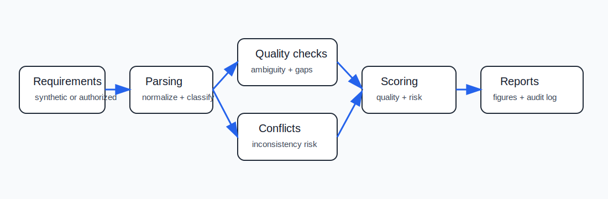
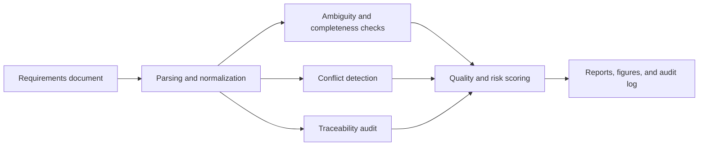

# AI-Assisted Software Requirements Quality Analyzer

<p align="center"><strong>Research-grade requirements quality analyzer for detecting ambiguity, missing requirements, conflicts, risk, traceability gaps, and testability problems before implementation begins.</strong></p>

<p align="center">
  <a href="../../actions/workflows/python-checks.yml"></a>
  <a href="LICENSE"></a>
  
  
</p>

> **Review-support boundary:** this repository uses fictional synthetic software requirements by default. It is research and quality-review infrastructure only. It must not automatically approve, reject, rewrite, or prioritize production requirements without product-owner, engineering, QA, security, and stakeholder review.

---

## Research objective

Can an AI-assisted requirements quality analyzer improve early software specification review by detecting ambiguity, missing information, conflicts, risk, and testability gaps before implementation begins?

| Research question | Evidence generated locally |
| --- | --- |
| Which requirements are ambiguous or unverifiable? | Quality checks and ambiguity table |
| Which requirements are missing acceptance criteria or tests? | Traceability and testability audit |
| Which requirements conflict with each other? | Conflict register and conflict matrix |
| Which modules carry the highest specification risk? | Module-level quality summary |
| Can review decisions remain auditable? | Hash-chained audit ledger |
| Can the pipeline run without private data? | Synthetic fictional requirements corpus |

---

## Architecture

<p align="center"></p>



---

## Run today — no private requirements needed

```bash
python scripts/run_synthetic_requirements_lab.py
```

Windows quick start:

```bat
cd %USERPROFILE%\ai-assisted-software-requirements-quality-analyzer
git pull

py -m venv .venv
.venv\Scripts\activate

python -m pip install --upgrade pip
python -m pip install -r requirements.txt
python scripts/run_synthetic_requirements_lab.py
```

Optional controls:

```bash
python scripts/run_synthetic_requirements_lab.py --repeat-templates 4 --seed 42
```

---

## Generated local outputs

```text
outputs/results/synthetic_requirements.csv
outputs/results/synthetic_parsed_requirements.csv
outputs/results/synthetic_quality_checks.csv
outputs/results/synthetic_conflict_register.csv
outputs/results/synthetic_duplicate_candidates.csv
outputs/results/synthetic_traceability_audit.csv
outputs/results/synthetic_acceptance_criteria_patterns.csv
outputs/results/synthetic_requirement_quality_scores.csv
outputs/results/synthetic_module_quality_summary.csv
outputs/results/synthetic_requirements_summary.json
outputs/reports/synthetic_requirements_quality_report.md
outputs/audit/requirements_quality_audit_log.jsonl

outputs/figures/synthetic_quality_by_module.png
outputs/figures/synthetic_issue_counts.png
outputs/figures/synthetic_quality_distribution.png
outputs/figures/synthetic_conflict_matrix.png
outputs/figures/synthetic_review_priority.png
```

Every output is generated locally from fictional requirements.

---

## Requirement quality checks

| Check | What it detects |
| --- | --- |
| Ambiguous wording | Terms such as fast, easy, appropriate, user-friendly, some, various |
| Missing acceptance criteria | Requirements without clear observable pass/fail conditions |
| Missing actor or boundary | Requirements that do not identify the actor/system |
| Missing priority | Requirements without prioritization metadata |
| Missing linked test | Traceability gap between requirement and verification |
| Unverifiable statement | Non-measurable claims that are difficult to test |
| Conflict candidate | Opposing or inconsistent requirement pairs |
| Risk flag | Security, privacy, compliance, or sensitive-data exposure indicators |

---

## Scoring model

The lab computes transparent rule-based metrics:

| Metric | Meaning |
| --- | --- |
| `ambiguity_score` | Higher means more ambiguous or unverifiable wording |
| `testability_score` | Higher means easier to verify through acceptance criteria and tests |
| `completeness_score` | Higher means fewer missing fields |
| `conflict_risk_score` | Higher means involved in potential contradictions |
| `traceability_score` | Higher means acceptance/design/test links are present |
| `risk_score` | Composite review-risk signal |
| `requirement_quality_index` | Overall requirement review quality estimate |
| `review_priority` | Low, medium, or high human-review priority |

---

## Project map

```text
src/reqquality/
  synthetic.py        # fictional requirements generator
  parsing.py          # normalization, tokenization, modality classification
  quality_checks.py   # ambiguity, missing info, risk, and testability checks
  conflicts.py        # conflict and duplicate candidate detection
  traceability.py     # acceptance criteria and design/test link audit
  scoring.py          # quality, risk, and review-priority scores
  audit.py            # hash-chained analysis log
  visualization.py    # local figures
  reporting.py        # Markdown report generator
  config.py           # output directory and reproducibility helpers

scripts/
  run_synthetic_requirements_lab.py

tests/
  pytest coverage for synthetic data, checks, conflicts, scoring, audit, and pipeline smoke test
```

---

## MATLAB plotting

After running the Python lab:

```matlab
addpath('matlab')
plot_requirements_metrics('outputs')
```

---

## Real-project extension policy

For authorized real software specifications:

1. Put approved source data under `data/raw/`.
2. Add metadata for module, requirement type, actor, priority, acceptance criteria, and linked tests.
3. Remove confidential information before sharing results.
4. Have product, engineering, QA, security, and legal stakeholders review tool outputs.
5. Treat all flags as review candidates, not final decisions.

---

## Limitations

- The initial analyzer is deterministic and rule-based.
- Ambiguity detection can produce false positives.
- Conflict detection is phrase-based and not a full formal specification solver.
- Synthetic data does not represent every domain.
- Real deployments require domain-specific taxonomies, reviewer calibration, access control, and governance.

---

## Future extensions

- Transformer-based semantic duplicate and conflict detection
- LLM-assisted requirement critique with citation-grounded evidence
- Jira/GitHub Issues/Azure DevOps importers
- Formal requirement ontology extraction
- Human-in-the-loop review dashboard
- Requirements-to-test generation evaluation
- Bias and stakeholder-impact audit for requirement prioritization
